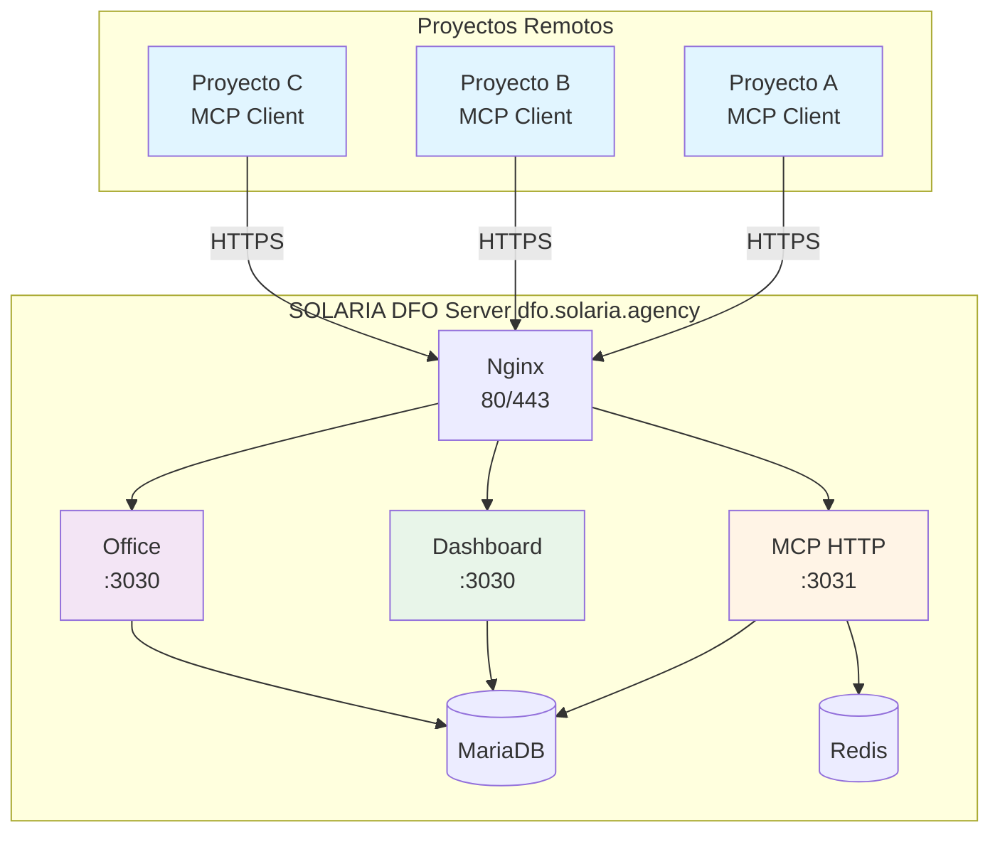
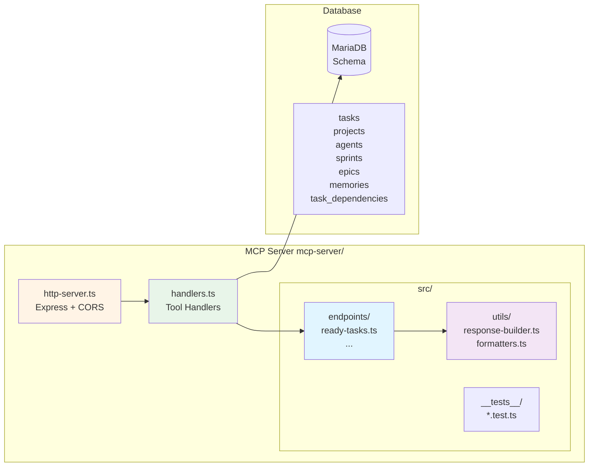
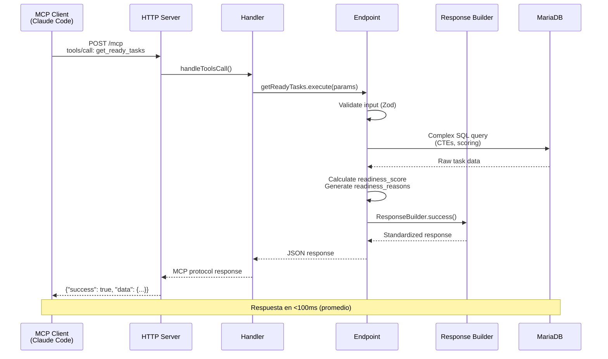

# SOLARIA Digital Field Operations

**Oficina Digital de Construccion en Campo** - Version 3.3.0

Sistema centralizado para gestion de proyectos de software con supervision ejecutiva (CEO/CTO/COO/CFO) e integracion con agentes IA via MCP.

> 📋 **Enhancement Plan 2025**: Consulta [docs/DFO-ENHANCEMENT-PLAN-2025.md](docs/DFO-ENHANCEMENT-PLAN-2025.md) para el roadmap completo (7 sprints, 190 horas).

---

## 🎯 Estado Actual

| Servicio | Estado | URL |
|----------|--------|-----|
| Dashboard | ✅ Online | https://dfo.solaria.agency |
| MCP Server | ✅ Online | https://dfo.solaria.agency/mcp |
| API REST | ✅ Online | https://dfo.solaria.agency/api |
| Public API | ✅ Online | https://dfo.solaria.agency/api/public |

### Verificar Conexion MCP

```bash
# Health check
curl https://dfo.solaria.agency/mcp/health

# Respuesta esperada:
# {"status":"ok","timestamp":"...","dashboard":"connected","sessions":0}

# Listar herramientas MCP disponibles
curl -X POST https://dfo.solaria.agency/mcp \
  -H "Content-Type: application/json" \
  -H "Authorization: Bearer default" \
  -d '{"jsonrpc":"2.0","id":1,"method":"tools/list"}'
```

---

## 🏗️ Arquitectura del Sistema

### Vista de Alto Nivel



### Arquitectura Interna MCP Server



### Flujo de Petición MCP



---

## 🚀 Arquitectura Centralizada

A partir de la version 3.1, DFO opera como un **servicio centralizado** al que los proyectos se conectan remotamente via MCP HTTP:

```
┌─────────────────┐     ┌─────────────────┐     ┌─────────────────┐
│   Proyecto A    │     │   Proyecto B    │     │   Proyecto C    │
│  (MCP Client)   │     │  (MCP Client)   │     │  (MCP Client)   │
└────────┬────────┘     └────────┬────────┘     └────────┬────────┘
         │                       │                       │
         └───────────────────────┼───────────────────────┘
                                 │
                    HTTPS (dfo.solaria.agency)
                                 │
                                 ▼
┌────────────────────────────────────────────────────────────────┐
│                    SOLARIA DFO Server                          │
│  ┌──────────────┐    ┌──────────────┐    ┌──────────────┐     │
│  │    Nginx     │───►│  MCP HTTP    │───►│   Dashboard  │     │
│  │   (80/443)   │    │   (:3031)    │    │   (:3030)    │     │
│  └──────────────┘    └──────────────┘    └──────┬───────┘     │
│                                                  │             │
│                                           ┌──────▼───────┐     │
│                                           │   MariaDB    │     │
│                                           │  (embedded)  │     │
│                                           └──────────────┘     │
└────────────────────────────────────────────────────────────────┘
```

---

## ⚡ Conexion Rapida (Para Proyectos)

### Opcion 1: Script automatico

```bash
bash <(curl -s https://dfo.solaria.agency/install.sh)
```

### Opcion 2: Manual

```bash
# Descargar e instalar cliente MCP
curl -O https://raw.githubusercontent.com/SOLARIA-AGENCY/solaria-digital-field--operations/main/scripts/install-mcp-remote.sh
chmod +x install-mcp-remote.sh
./install-mcp-remote.sh
```

El script detectara automaticamente tu entorno (Claude Code, Cursor, Windsurf, etc.) y configurara la conexion.

### Opcion 3: Configuracion Manual por IDE

#### Claude Code

Editar `~/.claude/claude_code_config.json`:

```json
{
  "mcpServers": {
    "solaria-dfo": {
      "transport": {
        "type": "http",
        "url": "https://dfo.solaria.agency/mcp"
      },
      "headers": {
        "Authorization": "Bearer default",
        "X-Project-Id": "mi-proyecto"
      }
    }
  }
}
```

#### Cursor

Editar `~/.config/Cursor/User/mcp.json` (Linux) o `~/Library/Application Support/Cursor/User/mcp.json` (macOS):

```json
{
  "mcpServers": {
    "solaria-dfo": {
      "transport": "http",
      "url": "https://dfo.solaria.agency/mcp",
      "headers": {
        "Authorization": "Bearer default",
        "X-Project-Id": "mi-proyecto"
      }
    }
  }
}
```

#### Windsurf

Editar `~/.config/windsurf/mcp_config.json` (Linux) o `~/Library/Application Support/Windsurf/mcp_config.json` (macOS):

```json
{
  "mcpServers": {
    "solaria-dfo": {
      "transport": "http",
      "url": "https://dfo.solaria.agency/mcp"
    }
  }
}
```

Despues de configurar, reinicia tu IDE para activar la conexion MCP.

---

## 🔐 Aislamiento de Proyectos (Multi-Agente)

Cuando multiples agentes Claude trabajan simultaneamente en diferentes proyectos, cada uno debe establecer su contexto de proyecto al inicio de la sesion.

### Paso 1: El Agente Establece su Contexto

Al iniciar trabajo en un proyecto, el agente debe llamar:

```
set_project_context({project_name: "Nombre del Proyecto"})
```

O por ID:
```
set_project_context({project_id: 1})
```

O por directorio de trabajo:
```
set_project_context({working_directory: "/path/to/my-project"})
```

### Paso 2: Aislamiento Automatico

Una vez establecido el contexto:
- `list_projects` → Solo retorna el proyecto asignado
- `list_tasks` → Solo tareas del proyecto
- `create_task` → Se crea en el proyecto correcto
- Intentar acceder a otros proyectos retorna "ACCESS DENIED"

### Verificar Contexto Actual

```
get_current_context()
```

Retorna:
```json
{
  "project_id": 1,
  "isolation_enabled": true,
  "message": "You are working in project #1. All operations are isolated to this project."
}
```

### Ejemplo de Flujo de Trabajo

```
Usuario: Crea una tarea para implementar login

Agente: Primero establezco el contexto del proyecto...
[Llama set_project_context({project_name: "PRILABSA Website"})]

Agente: Contexto establecido. Ahora creo la tarea...
[Llama create_task({title: "Implementar login", priority: "high"})]

Tarea creada en proyecto PRILABSA Website (aislado de otros proyectos)
```

---

## 🎨 Dashboard

- **URL:** https://dfo.solaria.agency

---

## 🏢 SOLARIA OFFICE

`office.solaria.agency` es el dashboard de gestión orientado a Project Managers y Account Managers.

- Enfoque: visión macro de proyectos, clientes y presupuestos con modo claro fijo.
- Contraste con `dfo.solaria.agency`: DFO es táctico para producción/dark mode; OFFICE es estratégico y "cara al cliente".
- Servicio: el contenedor `office` (puerto 3030) expone este frontend + API ya existente.
- Funcionalidad: login reutilizando `/api/auth/login`, vistas de cartera con presupuestos desglosados, clientes consolidados y assets por proyecto desde Design Hub.
- Alcance: OFFICE solo muestra proyectos compartidos explícitamente (campo `office_visible=1` o creados con `office_origin=office`). Los proyectos creados desde OFFICE siguen visibles en DFO, y desde DFO puedes activar la visibilidad hacia OFFICE con `PUT /api/projects/:id { office_visible: true }`.
- **Usuario:** carlosjperez
- **Password:** bypass

---

## 🛠️ MCP Tools Disponibles

### Gestión de Proyectos
- `list_projects` - Listar todos los proyectos
- `create_project` - Crear nuevo proyecto
- `get_project` - Obtener detalle de proyecto
- `update_project` - Actualizar proyecto

### Gestión de Tareas
- `list_tasks` - Listar tareas (filtrable por proyecto, estado, prioridad)
- `get_ready_tasks` - **🆕 [DFN-004]** Tareas listas para trabajar (sin bloqueadores, con scoring inteligente)
- `create_task` - Crear nueva tarea
- `update_task` - Actualizar tarea
- `complete_task` - Marcar tarea como completada

### Agentes IA
- `list_agents` - Listar agentes SOLARIA
- `get_agent` - Obtener estado de agente
- `update_agent_status` - Actualizar estado

### Dashboard & Analytics
- `get_dashboard_overview` - KPIs ejecutivos
- `get_dashboard_alerts` - Alertas activas
- `log_activity` - Registrar actividad

### Memoria Persistente (Integrado de Memora)

Sistema de memoria persistente para agentes IA con busqueda full-text, semantic search y referencias cruzadas.

- `memory_create` - Crear nueva memoria (decisiones, contexto, aprendizajes)
- `memory_list` - Listar memorias con filtros por tags, importancia
- `memory_get` - Obtener memoria especifica (incrementa contador de acceso)
- `memory_update` - Actualizar contenido de memoria
- `memory_delete` - Eliminar memoria
- `memory_search` - Busqueda full-text en memorias
- `memory_semantic_search` - **🔍 Búsqueda semántica** con vectores de embeddings
- `memory_tags` - Listar tags disponibles
- `memory_stats` - Estadisticas de uso de memoria
- `memory_boost` - Aumentar importancia de una memoria util
- `memory_related` - Obtener memorias relacionadas via cross-references
- `memory_link` - Crear relacion entre dos memorias

#### Ejemplo de Uso de Memoria
```
Usuario: Recuerda que decidimos usar JWT para autenticacion

Claude: Voy a crear una memoria para esta decision:

[Llama a memory_create con:
  - content: "Arquitectura de autenticacion: Usaremos JWT tokens con refresh tokens..."
  - tags: ["decision", "architecture", "security"]
  - importance: 0.8
]

Memoria creada con ID #15. Puedo recuperarla mas tarde con memory_search.
```

---

## 📊 Nuevas Características (Sprint 1 - 2025)

### DFN-002: JSON-First API Standardization ✅

Todos los endpoints ahora siguen un estándar de respuesta unificado:

```typescript
interface StandardResponse {
  success: boolean;
  data?: any;                    // En success: true
  error?: ErrorObject;           // En success: false
  metadata?: {
    timestamp: string;
    request_id: string;
    execution_time_ms: number;
    version: string;             // Semantic versioning
  };
  format?: 'json' | 'human';     // Formato de salida
  formatted?: string;            // Human-readable output
}
```

**Beneficios:**
- Discriminated unions para type safety
- Metadata automático en todas las respuestas
- Formato `human` opcional para mejor UX
- Versionado semántico de API
- Error handling consistente

📖 [Ver especificación completa](docs/specs/DFN-002-json-api-standardization.md)

### DFN-004: Ready Tasks Endpoint ✅

Nuevo endpoint inteligente para identificar tareas listas para trabajar:

```typescript
get_ready_tasks({
  project_id?: number,
  agent_id?: number,
  sprint_id?: number,
  priority?: 'low' | 'medium' | 'high' | 'critical',
  limit?: number,              // Default: 10, Max: 100
  format?: 'json' | 'human'
})
```

**Algoritmo de Readiness Score (0-100):**
- Base: 50 puntos
- +30 prioridad critical, +20 high, +10 medium
- +15 sprint activo
- +5 asignado a agente
- +5 con estimación de horas
- +10 deadline próximo (≤7 días)
- -10 deadline vencido

**Filtrado Inteligente:**
- ✅ Solo tareas `pending`
- ✅ Sin bloqueadores incompletos (check de `task_dependencies`)
- ✅ Sprint activo o planeado
- ✅ Epic no cancelado
- 🔄 Fallback si tabla `task_dependencies` no existe

**Ejemplo de Uso:**

```bash
# Comando Claude Code
/dfo ready --priority high --sprint 1

# Respuesta
📋 Ready Tasks (3):

1. 🔴 DFN-003: Health Check Automatizado
   Readiness: 85/100 | Priority: high
   Sprint: Sprint 1 - Foundation
   Estimated: 4h
   ✓ No blocking dependencies | ✓ HIGH priority | ✓ Part of active sprint

2. 🟡 DFN-005: Stats Dashboard DFO
   Readiness: 75/100 | Priority: medium
   ...
```

📖 [Ver especificación completa](docs/specs/DFN-004-ready-tasks-endpoint.md)

---

## 📚 Ejemplo de Uso con Claude Code

```
Usuario: Crea una tarea para implementar autenticacion JWT

Claude: Voy a usar la herramienta create_task del servidor SOLARIA DFO:

[Llama a create_task con:
  - title: "Implementar autenticacion JWT"
  - description: "Sistema de autenticacion con tokens JWT"
  - priority: "high"
  - project_id: 1
]

Tarea creada exitosamente con ID #42. Esta asignada al proyecto y visible en el dashboard.
```

---

## 💻 Desarrollo Local (Solo para contribuidores)

Si necesitas ejecutar DFO localmente para desarrollo:

### Requisitos
- Docker y Docker Compose
- Node.js 22+
- pnpm

### Instalacion Local

```bash
# 1. Clonar repositorio
git clone https://github.com/SOLARIA-AGENCY/solaria-digital-field--operations.git
cd solaria-digital-field--operations

# 2. Configurar entorno
cp .env.example .env

# 3. Levantar servicios
docker compose up -d

# 4. Verificar
curl http://localhost:3030/api/health
```

### Comandos de Desarrollo

```bash
# Desarrollo
docker compose up -d              # Iniciar
docker compose logs -f office     # Ver logs
docker compose down               # Detener

# Testing
pnpm test                         # Tests API
pnpm test:ui                      # Tests UI

# MCP Local
cd mcp-server && npm run dev      # MCP stdio (local)
cd mcp-server && npm run dev:http # MCP HTTP (servidor)

# Tests MCP Server
cd mcp-server/src
npm test                          # Run all tests
npm test -- ready-tasks.test.ts   # Test específico
npm run test:coverage             # Coverage report
```

---

## 🚢 Despliegue en Produccion

### Deploy a VPS (Hostinger/Hetzner/etc)

```bash
# 1. Clonar en servidor
ssh root@your-server
cd /var/www
git clone https://github.com/SOLARIA-AGENCY/solaria-digital-field--operations.git solaria-dfo
cd solaria-dfo

# 2. Configurar
cp .env.prod.example .env.prod

# 3. Generar JWT secret
openssl rand -hex 32  # Copiar a JWT_SECRET en .env.prod

# 4. Configurar SSL (Let's Encrypt)
certbot certonly --standalone -d dfo.your-domain.com

# 5. Desplegar
docker compose -f docker-compose.prod.yml up -d

# 6. Verificar
curl https://dfo.your-domain.com/api/health
curl https://dfo.your-domain.com/mcp/health
```

### Servicios en Produccion

| Servicio | Puerto | Descripcion |
|----------|--------|-------------|
| nginx | 80/443 | Reverse proxy con SSL |
| office | 3030 | Dashboard + API + MariaDB |
| mcp-http | 3031 | MCP HTTP transport |
| redis | 6379 | Cache y colas |

---

## 🌐 API Publica (Sin Autenticacion)

Endpoints disponibles para el PWA Dashboard y acceso publico (solo lectura):

```bash
# Proyectos
GET /api/public/projects      # Lista todos los proyectos con stats
GET /api/public/businesses    # Lista todos los negocios
GET /api/public/tasks         # Lista todas las tareas
GET /api/public/tasks?project_id=1  # Tareas filtradas por proyecto
GET /api/public/dashboard     # Stats agregados

# Ejemplo
curl https://dfo.solaria.agency/api/public/projects
```

### Respuesta de ejemplo `/api/public/projects`:
```json
{
  "projects": [
    {
      "id": 2,
      "name": "Akademate.com",
      "description": "Plataforma SaaS multitenant...",
      "client": "Akademate SaaS",
      "status": "planning",
      "priority": "critical",
      "budget": "250000.00",
      "task_count": 12,
      "pending_tasks": 12,
      "completed_tasks": 0
    }
  ]
}
```

---

## 🔒 API REST (Requiere Autenticacion)

### Autenticacion
```
POST /api/auth/login    - { userId, password }
POST /api/auth/logout
GET  /api/auth/verify
```

### Proyectos
```
GET    /api/projects
POST   /api/projects
GET    /api/projects/:id
PUT    /api/projects/:id
```

### Tareas
```
GET    /api/tasks?project_id=1&status=pending
POST   /api/tasks
PUT    /api/tasks/:id
```

### C-Suite
```
GET /api/csuite/ceo   - Vista CEO
GET /api/csuite/cto   - Vista CTO
GET /api/csuite/coo   - Vista COO
GET /api/csuite/cfo   - Vista CFO
```

---

## 📁 Estructura del Proyecto

```
solaria-digital-field--operations/
├── dashboard/                     # C-Suite Dashboard
│   ├── server.js                  # Express + Socket.IO
│   └── public/                    # Frontend
├── mcp-server/                    # MCP Server
│   ├── server.ts                  # Stdio transport (local)
│   ├── http-server.ts             # HTTP transport (remoto)
│   ├── handlers.ts                # Handlers compartidos
│   └── src/                       # 🆕 Source organizado
│       ├── endpoints/             # Tool implementations
│       │   └── ready-tasks.ts     # DFN-004
│       ├── utils/                 # Utilities compartidas
│       │   ├── response-builder.ts # DFN-002
│       │   └── formatters.ts      # DFN-002
│       └── __tests__/             # Test suites
│           ├── response-builder.test.ts
│           ├── formatters.test.ts
│           └── ready-tasks.test.ts
├── docs/                          # 🆕 Documentación técnica
│   ├── DFO-ENHANCEMENT-PLAN-2025.md
│   ├── BATCH-COMPLETED-DFN-004.md
│   └── specs/                     # Especificaciones técnicas
│       ├── DFN-002-json-api-standardization.md
│       ├── DFN-004-ready-tasks-endpoint.md
│       └── endpoint-migration-example.ts
├── infrastructure/
│   ├── database/
│   │   └── mysql-init.sql         # Schema inicial
│   └── nginx/
│       └── nginx.prod.conf        # Config produccion
├── scripts/
│   ├── install-mcp-remote.sh      # Instalador cliente MCP
│   └── install-mcp.sh             # Instalador local
├── docker-compose.yml             # Desarrollo local
├── docker-compose.prod.yml        # Produccion
└── README.md
```

---

## 🔧 Troubleshooting

### No puedo conectar via MCP
```bash
# Verificar que el servidor responde
curl https://dfo.solaria.agency/mcp/health

# Revisar configuracion local
cat ~/.claude/claude_code_config.json  # Claude Code
cat ~/.config/Cursor/User/mcp.json     # Cursor
```

### Dashboard no carga
```bash
# Verificar servicios
docker compose ps
docker compose logs office

# Reiniciar
docker compose restart office
```

### Error de autenticacion
```bash
# Las credenciales por defecto son:
# Usuario: carlosjperez
# Password: bypass
```

---

## 🤝 Contribuir

1. Fork el repositorio
2. Crear branch: `git checkout -b feature/mi-feature`
3. Commit: `git commit -m "feat: mi feature"`
4. Push: `git push origin feature/mi-feature`
5. Crear Pull Request

---

## 📋 Roadmap 2025

Consulta [docs/DFO-ENHANCEMENT-PLAN-2025.md](docs/DFO-ENHANCEMENT-PLAN-2025.md) para el plan completo:

**Sprint 1 (Completado):**
- ✅ DFN-001: Agent Capabilities Registry
- ✅ DFN-002: JSON-First API Standardization
- 🔄 DFN-003: Health Check Automatizado
- ✅ DFN-004: Comando /dfo ready
- ⏳ DFN-005: Stats Dashboard DFO
- ⏳ DFN-006: Fix endpoint inline documents

**Sprints 2-7:** Ver plan completo para infrastructure, security, metrics y optimization.

---

## 📄 Licencia

MIT License - Ver [LICENSE](LICENSE)

---

**SOLARIA Digital Field Operations** - *Gestion de proyectos potenciada por IA*

Dashboard: https://dfo.solaria.agency

(c) 2024-2025 SOLARIA AGENCY
