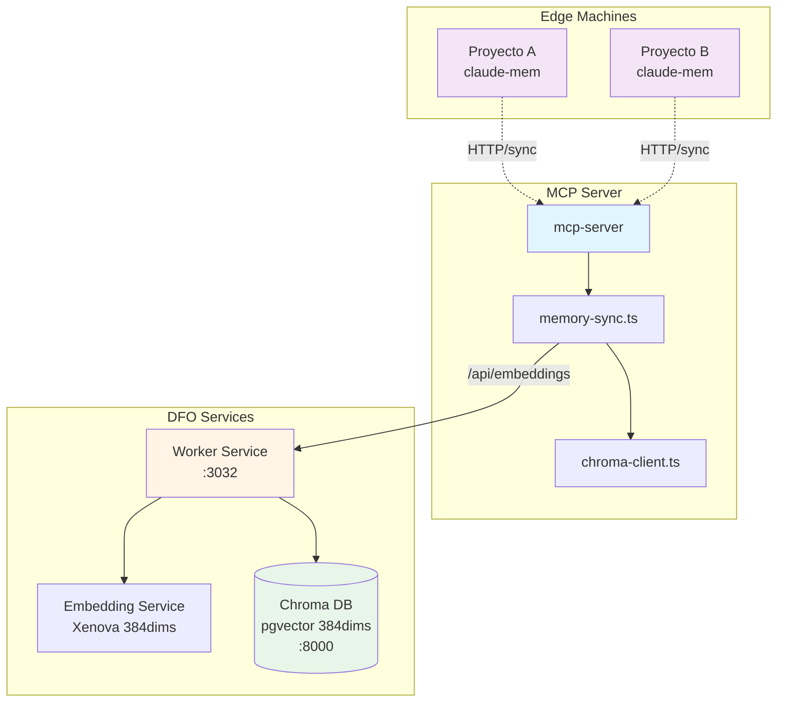

# Chroma Vector Database Integration - Guía de Uso

**Version:** 1.0.0
**Fecha:** 2026-01-06
**Autor:** ECO-Lambda | SOLARIA Memory System

---

## 📋 Resumen Ejecutivo

Integración de Chroma Vector DB con servicio de embeddings local (Transformers.js) para búsqueda semántica en memoria híbrida.

**Estado de Implementación:**
- ✅ Worker Service: `/api/embeddings` endpoint (OpenAI-compatible format)
- ✅ Chroma Client: Configurado con modelo Xenova/all-MiniLM-L6-v2 (384 dims)
- ✅ MCP Memory Sync: Vector search con fallback a full-text
- ⏳ Deployment: Requiere Docker containers activos

---

## 🏗️ Arquitectura



---

## 🔧 Configuración

### Variables de Entorno

| Variable | Descripción | Default |
|----------|-------------|---------|
| `CHROMA_URL` | URL del servicio Chroma | `http://localhost:8000` |
| `LLM_SERVICE_URL` | URL del servicio de embeddings | `http://localhost:3032` |
| `EMBEDDING_MODEL` | Modelo de embeddings | `Xenova/all-MiniLM-L6-v2` |
| `EMBEDDING_DIMENSION` | Dimensiones del embedding | `384` |

### Worker Service (:3032)

**Endpoints disponibles:**

| Método | Endpoint | Descripción |
|---------|-----------|-------------|
| GET | `/health` | Health check |
| GET | `/info` | Información del modelo |
| POST | `/embed` | Generar embedding (formato interno) |
| POST | `/api/embeddings` | Generar embedding (formato OpenAI-compatible) |
| POST | `/embed/batch` | Generar embeddings en batch |
| POST | `/similarity` | Calcular similitud coseno |

**Ejemplo de uso `/api/embeddings`:**
```bash
curl -X POST http://localhost:3032/api/embeddings \
  -H "Content-Type: application/json" \
  -d '{
    "text": "Arquitectura de autenticación con JWT",
    "model": "Xenova/all-MiniLM-L6-v2"
  }'
```

**Respuesta:**
```json
{
  "embedding": [0.1234, -0.5678, ...],  // 384 floats
  "model": "Xenova/all-MiniLM-L6-v2",
  "usage": {
    "prompt_tokens": 12,
    "total_tokens": 12
  }
}
```

---

## 📊 MCP Tools Integrados

### `memory_search_remote`

Busca en memoria central con opción de búsqueda vectorial.

**Parámetros:**
```typescript
{
  query: string,           // Required - Query de búsqueda
  project?: string,       // Optional - Filtrar por proyecto
  machine_id?: string,    // Optional - Filtrar por ID de máquina
  time_range?: {
    from?: string,        // ISO datetime
    to?: string          // ISO datetime
  },
  limit?: number,         // Default: 20, Max: 100
  include_embeddings?: boolean,  // Default: false - Activar búsqueda vectorial
  format?: 'json' | 'human'  // Default: 'json'
}
```

**Modos de búsqueda:**

1. **Full-text Search** (`include_embeddings=false`):
   - Búsqueda SQL con `LIKE %query%`
   - Rápido, sin dependencias externas
   - Recomendado para queries exactas

2. **Vector Search** (`include_embeddings=true`):
   - Genera embedding del query con Worker LLM
   - Búsqueda en Chroma DB por similitud vectorial
   - Incluye score de similitud (0-100%)
   - Fallback automático a full-text si Chroma falla

**Ejemplo:**
```bash
# Full-text search
memory_search_remote({
  query: "autenticación JWT",
  limit: 10,
  format: 'human'
})

# Vector search con embeddings
memory_search_remote({
  query: "arquitectura de autenticación",
  include_embeddings: true,
  limit: 5,
  project: "Akademate"
})
```

**Respuesta con vector search:**
```json
{
  "success": true,
  "data": {
    "observations": [
      {
        "id": "obs_123",
        "tool_name": "memory_create",
        "machine_id": "laptop-mbp",
        "similarity_score": "0.8745",  // Vector similarity
        "text_content": "...",
        "created_at": "2026-01-06T12:00:00Z"
      }
    ],
    "query": "arquitectura de autenticación",
    "total_results": 3,
    "search_mode": "vector"
  }
}
```

### `chroma_health_check`

Verificar estado del servicio Chroma.

**Uso:**
```bash
chroma_health_check({
  force_init: true  // Forzar inicialización de colecciones
})
```

**Respuesta:**
```json
{
  "success": true,
  "data": {
    "chroma_healthy": true,
    "chroma_url": "http://localhost:8000",
    "collections": {
      "memory_observations": "uuid-123",
      "memory_summaries": "uuid-456"
    },
    "message": "✅ Chroma service is available"
  }
}
```

---

## 🚀 Deployment

### Paso 1: Iniciar Servicios Docker

```bash
# Desde raíz del repo
docker compose up -d worker chroma

# Verificar estado
docker compose ps
docker compose logs -f worker
docker compose logs -f chroma
```

### Paso 2: Verificar Conexiones

```bash
# Chroma health
curl http://localhost:8000/api/v1/heartbeat

# Worker health
curl http://localhost:3032/health

# Worker model info
curl http://localhost:3032/info
```

### Paso 3: Inicializar Colecciones Chroma

```bash
# Desde MCP client
chroma_health_check({ force_init: true })
```

Esto creará automáticamente:
- `memory_observations`: Colección para observaciones de herramientas
- `memory_summaries`: Colección para resúmenes de sesiones

### Paso 4: Sincronizar Datos desde Edge

```bash
# Desde edge machine con dfo-sync-agent
python scripts/dfo-sync-agent.py --sync-mode=full
```

### Paso 5: Probar Búsqueda Vectorial

```bash
# Desde MCP client
memory_search_remote({
  query: "¿Cómo implementamos JWT?",
  include_embeddings: true,
  limit: 5,
  format: 'human'
})
```

---

## 📈 Rendimiento Esperado

| Operación | Tiempo Esperado | Notas |
|-----------|-----------------|--------|
| Inicializar modelo (primera vez) | 3-5s | Xenova se descarga una sola vez |
| Generar embedding (texto corto) | 50-150ms | 384 dimensions, Xenova quantized |
| Búsqueda Chroma (10k docs) | 50-200ms | pgvector index, cosine similarity |
| Búsqueda full-text SQL | 20-50ms | LIKE query con índice |
| Fallback Chroma→SQL | <10ms | Solo si Chroma no responde |

**Latencia total de búsqueda vectorial:**
- Edge (local): ~200-300ms (sin dependencias de red)
- Central (remoto): ~300-500ms (llamada a worker + Chroma)

---

## 🐛 Troubleshooting

### Error: "Chroma service not available"

**Síntoma:** `chroma_health_check` retorna `chroma_healthy: false`

**Solución:**
```bash
# Verificar Chroma está corriendo
curl http://localhost:8000/api/v1/heartbeat

# Reiniciar Chroma
docker compose restart chroma

# Ver logs
docker compose logs chroma
```

### Error: "LLM embedding API error: 500"

**Síntoma:** `memory_search_remote` con `include_embeddings=true` falla

**Solución:**
```bash
# Verificar Worker está corriendo
curl http://localhost:3032/health

# Verificar modelo cargado
curl http://localhost:3032/info

# Reiniciar Worker
docker compose restart worker

# Ver logs
docker compose logs worker | grep embedding
```

### Error: "Dimension mismatch"

**Síntoma:** Chroma rechaza embeddings por dimensiones incorrectas

**Solución:**
- Verificar `EMBEDDING_DIMENSION = 384` en `mcp-server/src/services/chroma-client.ts`
- Verificar Chroma collections creadas con dimension 384
- Recrear colecciones: `chroma_delete_collection` + `chroma_create_collection`

---

## 📝 Notas de Implementación

### Compatibilidad OpenAI

El endpoint `/api/embeddings` del worker implementa formato OpenAI-compatible para facilitar integración con Chroma y otros clientes:

- **Request:** `{ text: string, model?: string }`
- **Response:** `{ embedding: number[], model: string, usage: { prompt_tokens: number, total_tokens: number } }`

### Fallback Automático

El sistema tiene fallback en tres niveles:

1. **Vector search Chroma** → Si falla...
2. **Full-text search SQL** → Si Chroma no responde...
3. **Retornar error** → Si ambos métodos fallan

Esto garantiza que las operaciones críticas de memoria nunca se bloquean por fallos del servicio de embeddings.

### Modelo de Embeddings

- **Modelo:** Xenova/all-MiniLM-L6-v2
- **Dimensiones:** 384 floats
- **Peso:** ~100MB (quantized)
- **Performance:** ~100 embeddings/segundo en CPU local
- **Idiomas:** Multi-idioma (mejor en inglés)

**Alternativa futura:** Si se requiere embeddings de 1536 dims (OpenAI Ada-002), considerar:
- Migrar a servicio OpenAI API externo
- O usar modelo Xenova más grande (e.g., all-MiniLM-L12-v2)

---

## ✅ Checklist de Deploy

- [ ] Servicios Docker corriendo: `docker compose up -d`
- [ ] Chroma health OK: `curl http://localhost:8000/api/v1/heartbeat`
- [ ] Worker health OK: `curl http://localhost:3032/health`
- [ ] Colecciones Chroma creadas: `chroma_health_check({ force_init: true })`
- [ ] Datos sincronizados: `python scripts/dfo-sync-agent.py --sync-mode=full`
- [ ] Búsqueda vectorial probada: `memory_search_remote({ include_embeddings: true })`
- [ ] Performance dentro de SLA: <500ms queries

---

**© 2026 SOLARIA AGENCY | Digital Field Operations**
