# HANDOFF: Sprint 1 - Tareas Restantes DFO

**Fecha:** 2025-12-27
**Agente Origen:** ECO-Lambda
**Agente Destino:** Claude Code (Instancia Aislada)
**Estrategia:** Git Worktree Aislado

---

## 📋 CONTEXTO EJECUTIVO

Has sido asignado para completar el **Sprint 1** del **DFO Enhancement Plan 2025**, un roadmap de 7 sprints y 190 horas que moderniza el servidor MCP de SOLARIA Digital Field Operations.

### Estado Actual del Sprint 1

| Tarea | Estado | Responsable | Notas |
|-------|--------|-------------|-------|
| DFN-001 | ✅ Completado | ECO-Lambda | Spec document uploaded |
| DFN-002 | ✅ Completado | ECO-Lambda | JSON-First API + utils |
| DFN-004 | ✅ Completado | ECO-Lambda | Ready Tasks endpoint |
| **DFN-003** | ⏳ **Pendiente** | **TU** | Health Check endpoint |
| **DFN-005** | ⏳ **Pendiente** | **TU** | Stats Dashboard |
| **DFN-006** | ⏳ **Pendiente** | **TU** | Fix inline docs endpoint |

**Tu misión:** Implementar DFN-003, DFN-005 y DFN-006 en un worktree aislado para evitar colisiones con desarrollos paralelos.

---

## 🏗️ ARQUITECTURA DEL SISTEMA

### Vista de Alto Nivel


### MCP Server Internal (donde trabajarás)

```mermaid
graph TB
    subgraph "MCP Server Process"
        ROUTER[MCP Router]

        subgraph "Endpoints Layer"
            TASKS[Tasks Endpoints]
            PROJECTS[Projects Endpoints]
            AGENTS[Agents Endpoints]
            MEMORY[Memory Endpoints]
            DOCS[Documents Endpoints]
            HEALTH[Health Check<br/>DFN-003]
            READY[Ready Tasks<br/>DFN-004 ✅]
            STATS[Stats Dashboard<br/>DFN-005]
        end

        subgraph "Utils Layer"
            RB[ResponseBuilder<br/>DFN-002 ✅]
            FMT[Formatters<br/>DFN-002 ✅]
            VAL[Validators]
        end

        subgraph "Data Layer"
            MYSQL[(MariaDB)]
            REDIS[(Redis Cache)]
        end

        ROUTER --> TASKS
        ROUTER --> PROJECTS
        ROUTER --> AGENTS
        ROUTER --> MEMORY
        ROUTER --> DOCS
        ROUTER --> HEALTH
        ROUTER --> READY
        ROUTER --> STATS

        TASKS --> RB
        PROJECTS --> RB
        READY --> RB
        HEALTH --> RB
        STATS --> RB

        RB --> FMT

        TASKS --> MYSQL
        PROJECTS --> MYSQL
        MEMORY --> MYSQL
        DOCS --> MYSQL
        HEALTH --> MYSQL
        READY --> MYSQL
        STATS --> MYSQL

        HEALTH --> REDIS
        STATS --> REDIS
    end
```



---

## 📂 ESTRUCTURA DEL REPOSITORIO

```
SOLARIA-DFO/
├── mcp-server/
│   ├── src/
│   │   ├── endpoints/
│   │   │   ├── ready-tasks.ts          ✅ (DFN-004)
│   │   │   ├── health.ts               ⏳ (DFN-003 - TU)
│   │   │   ├── stats.ts                ⏳ (DFN-005 - TU)
│   │   │   └── inline-documents.ts     ⏳ (DFN-006 - TU, fix existing)
│   │   ├── utils/
│   │   │   ├── response-builder.ts     ✅ (DFN-002)
│   │   │   └── formatters.ts           ✅ (DFN-002)
│   │   └── __tests__/
│   │       ├── ready-tasks.test.ts     ✅ (70+ tests)
│   │       ├── response-builder.test.ts ✅ (70+ tests)
│   │       ├── formatters.test.ts      ✅ (70+ tests)
│   │       ├── health.test.ts          ⏳ (TU)
│   │       ├── stats.test.ts           ⏳ (TU)
│   │       └── inline-documents.test.ts ⏳ (TU)
│   └── server.ts                       (integración final)
├── docs/
│   ├── DFO-ENHANCEMENT-PLAN-2025.md    ✅ (roadmap maestro)
│   ├── specs/
│   │   ├── DFN-002-json-api-standardization.md ✅
│   │   ├── DFN-004-ready-tasks-endpoint.md     ✅
│   │   ├── DFN-003-health-check.md             ⏳ (TU - crear)
│   │   ├── DFN-005-stats-dashboard.md          ⏳ (TU - crear)
│   │   └── DFN-006-fix-inline-docs.md          ⏳ (TU - crear)
│   ├── BATCH-COMPLETED-DFN-004.md      ✅
│   └── HANDOFF-SPRINT-1-REMAINING.md   📄 (este archivo)
└── README.md                           ✅ (actualizado con v3.3.0)
```

---

## 🔧 CONFIGURACIÓN DE WORKTREE AISLADO

Para evitar conflictos con otros desarrollos en paralelo (dashboard, office, handlers existentes), trabajarás en un worktree separado.

### Setup Inicial

```bash
# 1. Clonar o navegar al repo principal
cd ~/Documents/GitHub/SOLARIA-DFO

# 2. Crear worktree aislado para Sprint 1
git worktree add ../SOLARIA-DFO-sprint1 -b feature/sprint-1-remaining

# 3. Cambiar al worktree
cd ../SOLARIA-DFO-sprint1

# 4. Verificar que estás en la rama correcta
git branch
# Output esperado: * feature/sprint-1-remaining

# 5. Instalar dependencias (si es necesario)
cd mcp-server
npm install
```

### Workflow de Desarrollo

```bash
# Trabajar en el worktree aislado
cd ~/Documents/GitHub/SOLARIA-DFO-sprint1

# Hacer commits regulares
git add .
git commit -m "feat(dfn-003): implement health check endpoint"

# Push de la branch feature
git push origin feature/sprint-1-remaining

# Cuando termines todas las tareas, crear PR
# El merge se hará después de code review
```

### Limpieza Final

```bash
# Después del merge del PR
cd ~/Documents/GitHub/SOLARIA-DFO
git worktree remove ../SOLARIA-DFO-sprint1
git branch -d feature/sprint-1-remaining
```

---

## 📝 TAREAS PENDIENTES (TU RESPONSABILIDAD)

### DFN-003: Health Check Automatizado

**Prioridad:** Alta
**Estimación:** 4 horas
**Descripción:** Endpoint `/health` para monitoreo de infraestructura

**Requerimientos:**

1. **Crear Spec:** `docs/specs/DFN-003-health-check.md`
   - Definir schema Zod de input (sin parámetros)
   - Definir schema de output (JSON y human format)
   - Checks requeridos: DB, Redis, filesystem, memoria, CPU

2. **Implementar:** `mcp-server/src/endpoints/health.ts`
   ```typescript
   export const getHealth: Tool = {
     name: 'get_health',
     description: 'Check system health status',
     inputSchema: z.object({
       format: z.enum(['json', 'human']).default('json'),
     }),
     async execute(params) {
       const builder = new ResponseBuilder({ version: '2.0.0' });

       // Checks:
       // 1. MariaDB connection
       // 2. Redis connection
       // 3. Disk space (/var/www)
       // 4. Memory usage
       // 5. CPU load
       // 6. Uptime

       return builder.success(healthData, {
         format: params.format,
         formatted: params.format === 'human' ? formatHealth(healthData) : undefined
       });
     }
   };
   ```

3. **Tests:** `mcp-server/src/__tests__/health.test.ts` (mínimo 20 tests)
   - Input validation
   - Healthy state
   - Degraded state (warning thresholds)
   - Unhealthy state (critical failures)
   - Human format output

4. **Formatters:** Agregar `formatHealth()` en `utils/formatters.ts`
   - Usar iconos: ✅ healthy, ⚠ degraded, ❌ unhealthy
   - Progress bars para métricas (memoria, CPU, disco)

---

### DFN-005: Stats Dashboard DFO

**Prioridad:** Media
**Estimación:** 6 horas
**Descripción:** Endpoint `/stats` para métricas agregadas del sistema

**Requerimientos:**

1. **Crear Spec:** `docs/specs/DFN-005-stats-dashboard.md`
   - Definir métricas: tasks por estado, proyectos activos, agents workload, velocity
   - Definir filtros: project_id, date_range, sprint_id
   - Esquema de respuesta JSON

2. **Implementar:** `mcp-server/src/endpoints/stats.ts`
   ```typescript
   export const getStats: Tool = {
     name: 'get_stats',
     description: 'Get aggregated system statistics',
     inputSchema: z.object({
       project_id: z.number().int().positive().optional(),
       sprint_id: z.number().int().positive().optional(),
       date_from: z.string().datetime().optional(),
       date_to: z.string().datetime().optional(),
       format: z.enum(['json', 'human']).default('json'),
     }),
     async execute(params) {
       const builder = new ResponseBuilder({ version: '2.0.0' });

       // Queries agregadas:
       // 1. Tasks: COUNT por status, priority
       // 2. Velocity: average completion time
       // 3. Workload: tasks por agent
       // 4. Projects: active/completed counts
       // 5. Sprints: active sprint progress

       return builder.success(stats, { format: params.format });
     }
   };
   ```

3. **Tests:** `mcp-server/src/__tests__/stats.test.ts` (mínimo 25 tests)
   - Input validation con date ranges
   - Filtros por proyecto y sprint
   - Agregaciones correctas
   - Human format con charts ASCII

4. **Formatters:** Agregar `formatStats()` en `utils/formatters.ts`
   - ASCII bar charts para task distribution
   - Velocity trend indicators (↑↓→)
   - Agent workload tables

---

### DFN-006: Fix Endpoint Inline Documents

**Prioridad:** Alta
**Estimación:** 2 horas
**Descripción:** Corregir bugs en endpoint de documentos inline

**Requerimientos:**

1. **Crear Spec:** `docs/specs/DFN-006-fix-inline-docs.md`
   - Documentar bugs conocidos (buscar en issues/logs)
   - Definir comportamiento correcto esperado
   - Plan de refactorización si es necesario

2. **Refactorizar:** `mcp-server/src/endpoints/inline-documents.ts`
   - Migrar a ResponseBuilder pattern (DFN-002)
   - Aplicar Zod validation estricta
   - Corregir manejo de errores
   - Asegurar soporte para format='human'

3. **Tests:** `mcp-server/src/__tests__/inline-documents.test.ts`
   - Cubrir edge cases que causaban bugs
   - Test de regresión para bugs corregidos
   - Cobertura >75%

4. **Formatter:** Agregar `formatDocument()` en `utils/formatters.ts`
   - Vista previa de contenido markdown
   - Metadata del documento

---

## 📚 RECURSOS DISPONIBLES

### Specs de Referencia

Lee estas specs completadas como ejemplo de calidad esperada:

- `docs/specs/DFN-002-json-api-standardization.md` - Patrón de API estandarizada
- `docs/specs/DFN-004-ready-tasks-endpoint.md` - Endpoint complejo con scoring

### Código de Referencia

Usa estos archivos como templates:

- `mcp-server/src/utils/response-builder.ts` - ResponseBuilder class
- `mcp-server/src/utils/formatters.ts` - Formatters registry
- `mcp-server/src/endpoints/ready-tasks.ts` - Endpoint con SQL complejo
- `mcp-server/src/__tests__/ready-tasks.test.ts` - Suite de tests completa

### Tests de Referencia

Sigue estos patrones de testing:

- `mcp-server/src/__tests__/response-builder.test.ts` - Utils testing
- `mcp-server/src/__tests__/formatters.test.ts` - Formatters testing
- `mcp-server/src/__tests__/ready-tasks.test.ts` - Endpoint testing

---

## ✅ CHECKLIST DE CALIDAD

Antes de crear el PR, verifica:

### Por Cada Tarea (DFN-003, DFN-005, DFN-006)

- [ ] **Spec creada** en `docs/specs/` con todos los detalles
- [ ] **Endpoint implementado** usando ResponseBuilder
- [ ] **Zod validation** para todos los inputs
- [ ] **Human format** implementado con formatters
- [ ] **Tests escritos** (mínimo 20 por endpoint)
- [ ] **Coverage >75%** verificado con `npm run test:coverage`
- [ ] **Tests pasando** con `npm test`
- [ ] **TypeScript compila** sin errores con `npm run build`
- [ ] **Formatters agregados** a registry en `utils/formatters.ts`
- [ ] **Código documentado** con JSDoc comments

### Integración Final

- [ ] **Todos los endpoints exportados** en index o server.ts
- [ ] **README.md actualizado** con nuevos endpoints
- [ ] **Version bump** a 3.4.0 en package.json
- [ ] **CHANGELOG.md** creado o actualizado con cambios
- [ ] **Mermaid diagrams actualizados** si es necesario
- [ ] **Git history limpio** (squash commits si es necesario)

---

## 🚀 PROCESO DE ENTREGA

### 1. Durante el Desarrollo

```bash
# Commits frecuentes y descriptivos
git add mcp-server/src/endpoints/health.ts
git commit -m "feat(dfn-003): implement health check endpoint core logic"

git add mcp-server/src/__tests__/health.test.ts
git commit -m "test(dfn-003): add health check test suite (25 tests)"

git add docs/specs/DFN-003-health-check.md
git commit -m "docs(dfn-003): add health check specification"
```

### 2. Antes del PR

```bash
# Ejecutar todos los tests
npm test

# Verificar coverage
npm run test:coverage

# Build para verificar TypeScript
npm run build

# Lint (si está configurado)
npm run lint

# Squash commits si es necesario
git rebase -i HEAD~10
```

### 3. Crear Pull Request

```bash
# Push de la branch feature
git push origin feature/sprint-1-remaining

# Crear PR en GitHub con este template:
```

**PR Template:**

```markdown
# Sprint 1 - Tareas Restantes (DFN-003, DFN-005, DFN-006)

## 📋 Resumen

Implementación de los endpoints restantes del Sprint 1 del DFO Enhancement Plan 2025:
- DFN-003: Health Check Automatizado
- DFN-005: Stats Dashboard DFO
- DFN-006: Fix Endpoint Inline Documents

## ✅ Tareas Completadas

- [ ] DFN-003: Health Check
  - [x] Spec creada
  - [x] Endpoint implementado
  - [x] Tests (XX tests, YY% coverage)
  - [x] Formatter agregado

- [ ] DFN-005: Stats Dashboard
  - [x] Spec creada
  - [x] Endpoint implementado
  - [x] Tests (XX tests, YY% coverage)
  - [x] Formatter agregado

- [ ] DFN-006: Fix Inline Docs
  - [x] Spec creada
  - [x] Bugs corregidos
  - [x] Tests de regresión
  - [x] Migrado a ResponseBuilder

## 📊 Métricas

- **Archivos creados:** XX
- **Líneas de código:** XXXX
- **Tests escritos:** XXX
- **Coverage:** XX%

## 🔗 Referencias

- Enhancement Plan: `docs/DFO-ENHANCEMENT-PLAN-2025.md`
- Handoff Document: `docs/HANDOFF-SPRINT-1-REMAINING.md`
- Related: DFN-002 (ResponseBuilder), DFN-004 (Ready Tasks)

## ✅ Checklist Pre-Merge

- [ ] Todos los tests pasando
- [ ] Coverage >75%
- [ ] TypeScript compila sin errores
- [ ] README actualizado
- [ ] Version bumped a 3.4.0
- [ ] Mermaid diagrams actualizados
```

---

## 📊 MÉTRICAS DE ÉXITO

Al finalizar, deberías tener:

| Métrica | Target | Verificación |
|---------|--------|--------------|
| **Specs creadas** | 3 | `ls docs/specs/DFN-00*.md` |
| **Endpoints implementados** | 3 | `ls mcp-server/src/endpoints/` |
| **Tests escritos** | >65 | `npm test -- --coverage` |
| **Coverage** | >75% | `npm run test:coverage` |
| **Líneas de código** | ~800 | `cloc mcp-server/src/` |
| **Commits** | ~15-20 | `git log --oneline` |

---

## 🆘 TROUBLESHOOTING

### Problema: Tests fallan con database mock

**Solución:** Usar el mismo patrón de mocking que `ready-tasks.test.ts`:

```typescript
jest.mock('../database', () => ({
  db: {
    query: jest.fn(),
  },
}));
```

### Problema: TypeScript no encuentra tipos de ResponseBuilder

**Solución:** Verificar imports relativos:

```typescript
import { ResponseBuilder } from '../utils/response-builder';
import { Formatters } from '../utils/formatters';
```

### Problema: Git worktree conflicts

**Solución:**

```bash
# Si el worktree ya existe
git worktree remove ../SOLARIA-DFO-sprint1 --force

# Recrear limpio
git worktree add ../SOLARIA-DFO-sprint1 -b feature/sprint-1-remaining
```

### Problema: npm install falla en worktree

**Solución:**

```bash
cd ~/Documents/GitHub/SOLARIA-DFO-sprint1/mcp-server
rm -rf node_modules package-lock.json
npm install
```

---

## 📞 CONTACTO Y ESCALACIÓN

Si encuentras blockers que requieren decisiones arquitectónicas:

1. **Documentar el blocker** en el worktree: `docs/BLOCKERS.md`
2. **Crear issue en GitHub** con label `sprint-1-blocker`
3. **Notificar a ECO-Lambda** con contexto completo
4. **Continuar con otras tareas** mientras esperas resolución

---

## 🎯 OBJETIVO FINAL

Al completar este handoff, el Sprint 1 estará **100% completo** y listo para producción:

- ✅ DFN-001: Enhancement Plan (ECO-Lambda)
- ✅ DFN-002: JSON-First API (ECO-Lambda)
- ✅ DFN-004: Ready Tasks (ECO-Lambda)
- ✅ **DFN-003: Health Check (TU)**
- ✅ **DFN-005: Stats Dashboard (TU)**
- ✅ **DFN-006: Fix Inline Docs (TU)**

**Sprint 1 Status:** 6/6 tasks (100%) → **READY FOR DEPLOYMENT**

---

## 📅 PRÓXIMOS PASOS (POST-MERGE)

Después del merge de tu PR:

1. **Deploy a staging** para QA
2. **Validación con `/dfo health`, `/dfo stats`**
3. **Inicio del Sprint 2** (DFN-007 a DFN-011)
4. **Retrospectiva del Sprint 1**

---

**¡Buena suerte, agente! Tienes todo lo necesario para completar el Sprint 1 con excelencia.**

**ECO-Lambda out.**

---

**Versión:** 1.0
**Autor:** ECO-Lambda
**Fecha:** 2025-12-27
**Repo:** [SOLARIA-DFO](https://github.com/carlosjperez/SOLARIA-DFO)
